# Daily Expenses Sharing Application

#### Overview :

This project is a backend application for managing daily expenses among users. It is developed using Java Spring Boot and MySQL as the database. The application supports user management, expense management, expense calculation, and balance sheet generation.

#### Features :

User Management: Create and retrieve user information.
Expense Management: Add and retrieve expenses associated with users.
Expense Calculation: Supports equal, exact, and percentage-based expense splitting.
Balance Sheet Generation: Generates a summary of expenses for users.

#### Technologies Used :

Spring Boot 3.3.2
Spring Data JPA
MySQL
Jakarta Validation
Lombok

# Database Configuration :

1. No tables Creation needed , everything is automated by hibernate
2. Just You need to create a schema in mysql workbench

The application uses a MySQL database. Ensure the database is set up and the connection details are provided in the application.properties file.

properties

#### MySQL Database Connection Configuration
spring.datasource.url=jdbc:mysql://localhost:3306/expensesharingdb
spring.datasource.username=root  //[change respective user name that is associated with Your workbench]
spring.datasource.password=Yash123@gmail  //[Password Need to be changed]
spring.datasource.driverClassName=com.mysql.cj.jdbc.Driver

#### JPA & Hibernate Configuration
spring.jpa.database-platform=org.hibernate.dialect.MySQL8Dialect
spring.jpa.hibernate.ddl-auto=update
spring.jpa.show-sql=true
spring.jpa.properties.hibernate.format_sql=true

## Project Structure :

Entities: Represent the data model for the application.

1. User
2. Expense
3. Participant
4. SplitType (ENUM)

Repositories: Data access layer for the entities.

1. UserRepository
2. ExpenseRepository

Services: Business logic layer.

1. UserService
2. ExpenseService

Controllers: API endpoints for interacting with the services.

1. UserController
2. ExpenseController

Utilities: Utility classes for additional functionalities.

1 ExpenseSplitUtil

# API Endpoints

### User Endpoints :

1. Create User

URL: /users
Method: POST
Request Body :

{
  "name": "user1",
  "email": "test1@gmail.com",
  "mobile": "1234567890"
}

2. Get User by ID

URL: /users/{id}
Method: GET

3. Get All Users

URL: /users
Method: GET

### Expense Endpoints :

1. Add Expense

URL: /expenses
Method: POST

2. Get Expense by ID

URL: /expenses/{id}
Method: GET

3. Get All Expenses

URL: /expenses
Method: GET

4. Get Expenses by User ID

URL: /expenses/user/{userId}
Method: GET

5. Download Balance Sheet

URL: /expenses/balance-sheet
Method: GET

# Installation and Setup

##### Clone the repository:

git clone https://github.com/yaswanth169/Daily_Expenses_Sharing_Application.git

Steps for running :

1. Unzip the app
2. Open App in intellij or else respective IDEA
3. Run the Application which contains main method 

#### Configure the database:

1. Ensure MySQL is installed and running.
2. Create a database named expensesharingdb.
3. Set up application properties:
4. Update the database connection details in src/main/resources/application.properties.

## Access the API:
1. The application will be available at http://localhost:8080

## Contact
For any inquiries, please contact [yaswanth169choudary@gmail.com].

Snapshots :

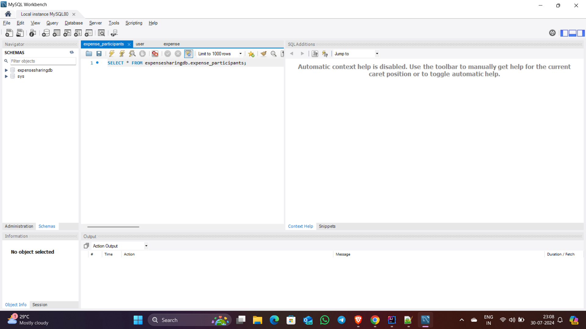

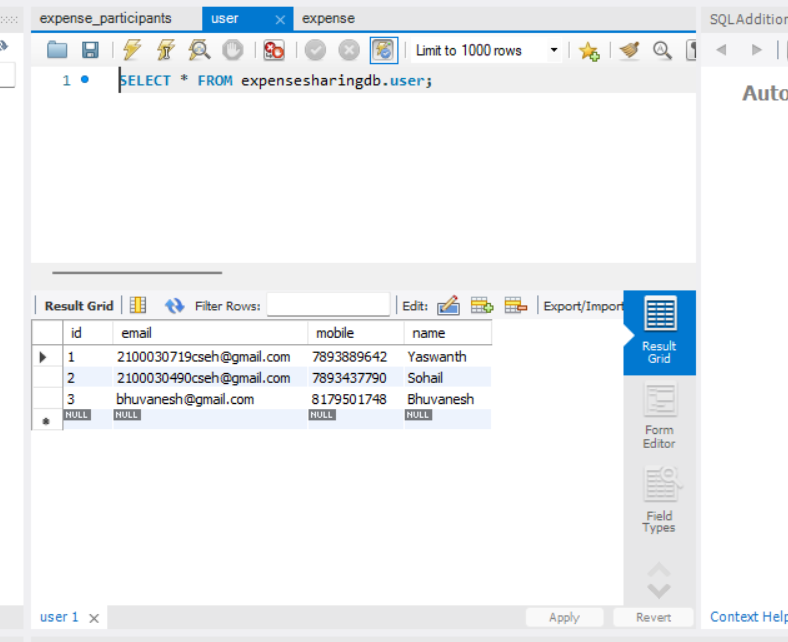

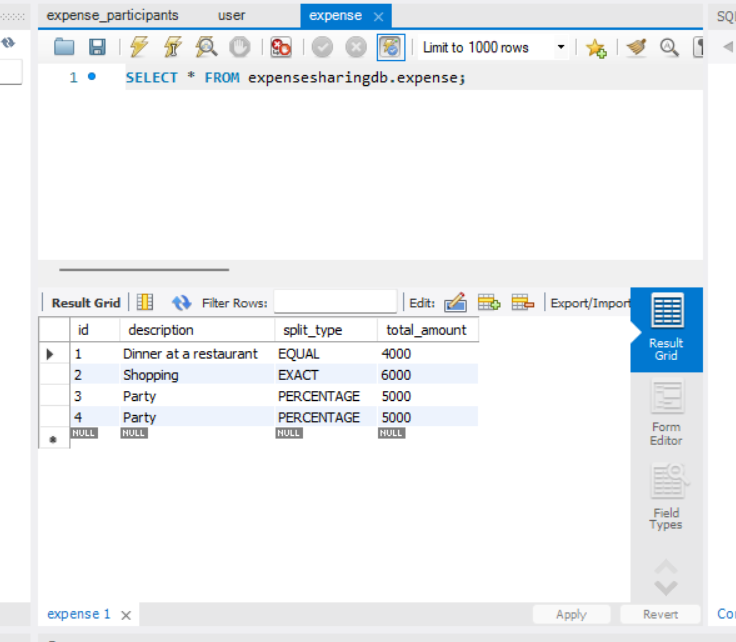

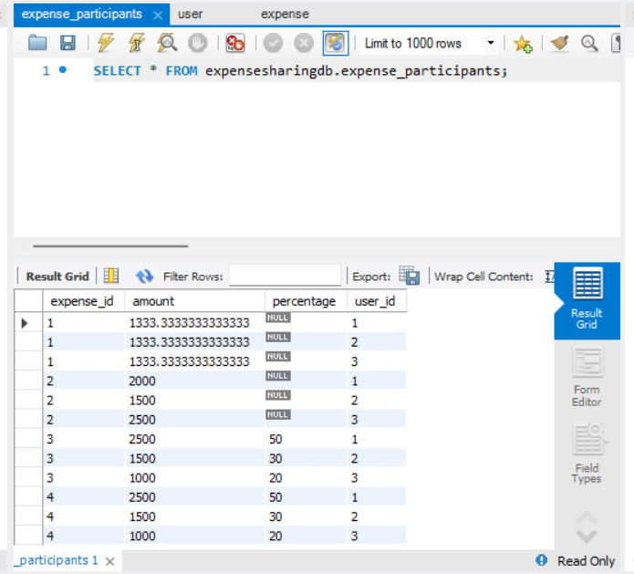

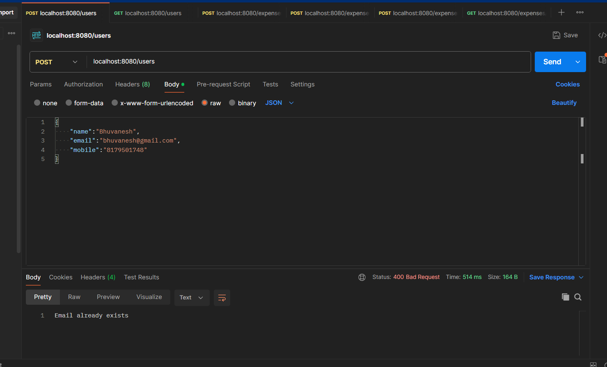

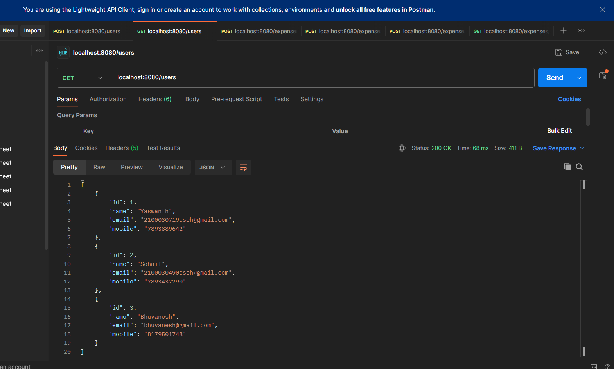

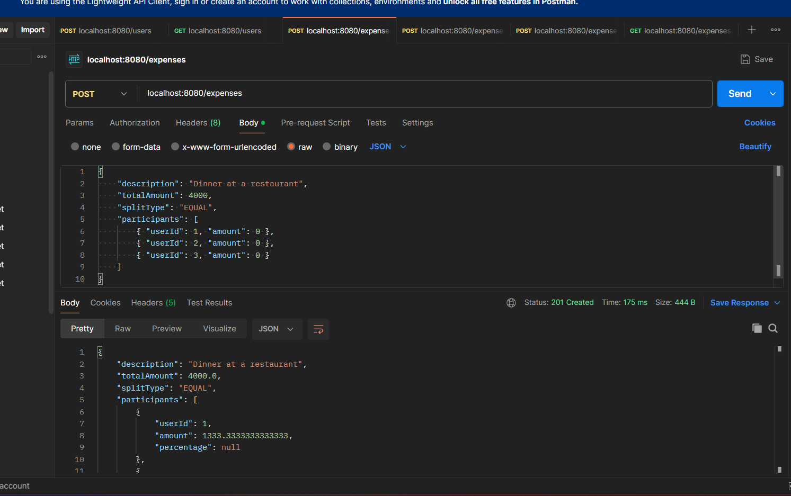

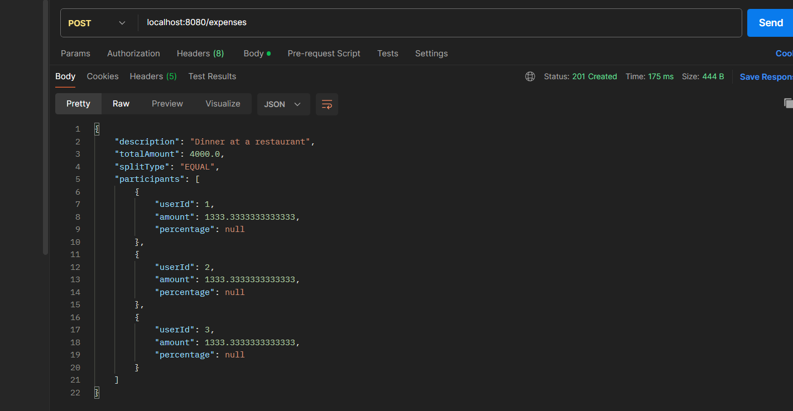

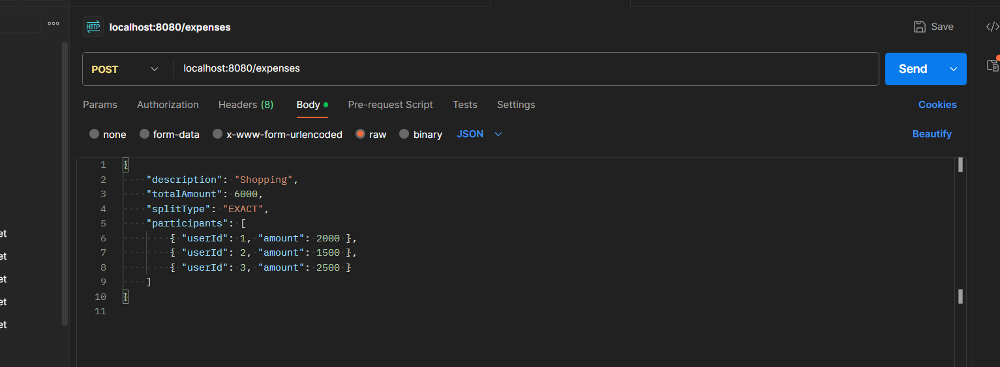

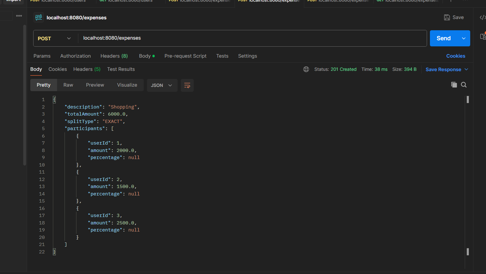

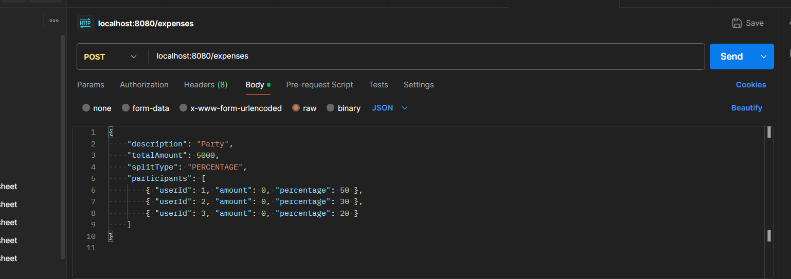

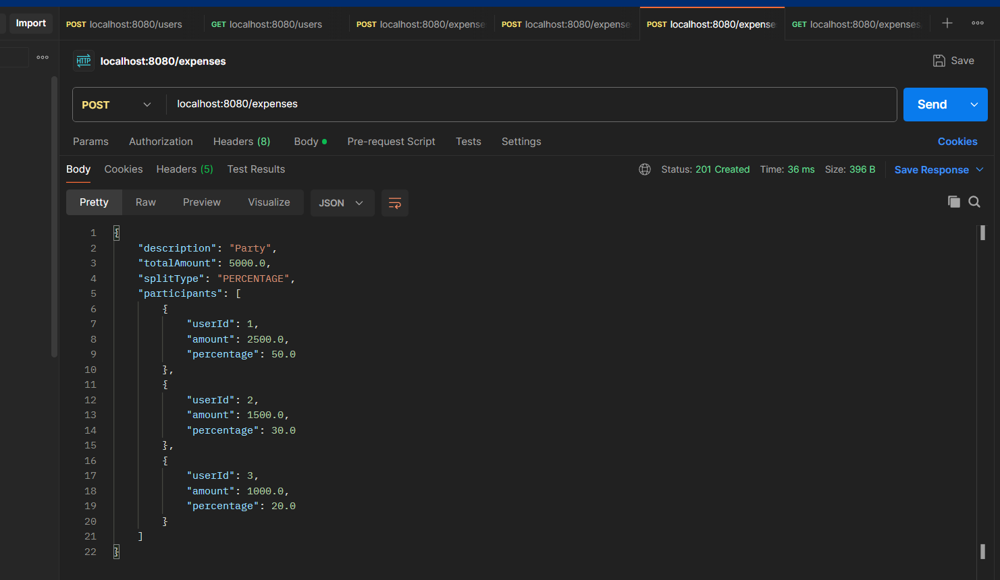

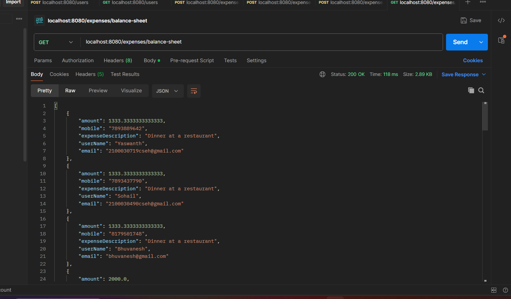

